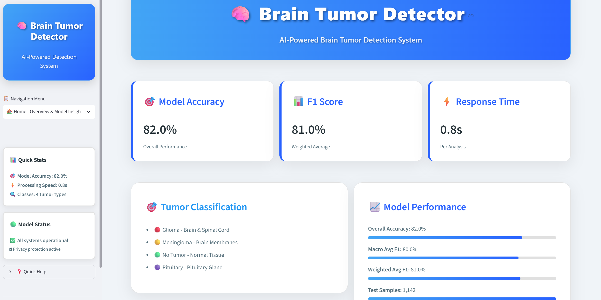
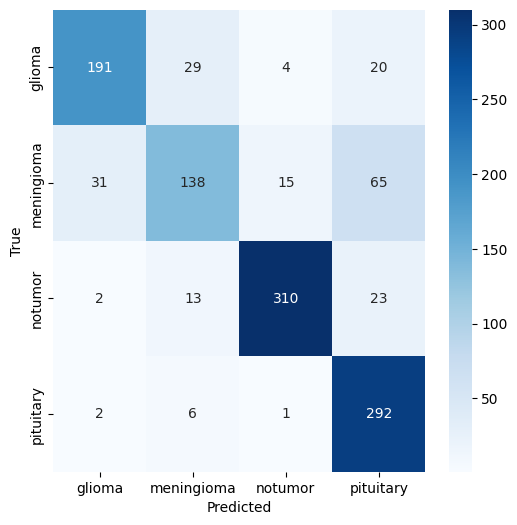
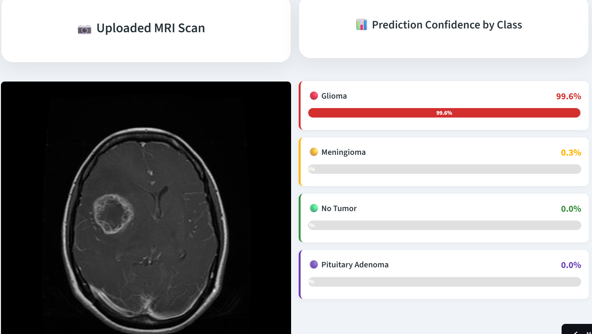

# 🧠 Brain Tumor Detection using InceptionV3


## 📌 Project Overview

Brain Tumor Detection is a deep learning application that classifies brain MRI images into four categories using **Transfer Learning with InceptionV3**.

The model is deployed as an interactive **Streamlit** web application where users can upload an MRI scan and receive an instant prediction with confidence scores.

---

## ✨ Features

- 🧠 Detects brain tumors from MRI scans
- 📂 Upload MRI images through a Streamlit interface
- 📊 Displays prediction confidence
- ⚡ Powered by Transfer Learning (InceptionV3)
- 🚀 Easy-to-use web application
- 📈 High classification accuracy

---

## 🧬 Classes

The model classifies MRI images into:

- Glioma
- Meningioma
- Pituitary Tumor
- No Tumor

---

## 🏗️ Model Architecture

- Transfer Learning
- InceptionV3
- TensorFlow / Keras
- Image Size: 224 × 224
- Optimizer: Adam
- Loss Function: Categorical Crossentropy

---

# 📷 Application Preview

## Streamlit Application



---

## Training Accuracy


---

## Confusion Matrix



---

## Sample Prediction



---

# 📂 Project Structure

```text
BrainTumor/
│
├── app.py
├── README.md
├── requirements.txt
├── .gitignore
│
├── images/
│   ├── app.png
│   ├── confusion_matrix.png
│   ├── training_accuracy.png
│   └── sample_prediction.png
│
├── models/
│   ├── brain_tumor_inceptionv3.keras
│   └── class_names.json
│
├── notebooks/
│   └── brain_tumor.ipynb
│
└── data/
```

---

# 📊 Model Performance

- ✅ Transfer Learning using InceptionV3
- ✅ Multi-Class Classification
- ✅ High Validation Accuracy
- ✅ Interactive Streamlit Deployment

---

# 📦 Installation

Clone the repository

```bash
git clone https://github.com/Akarsh5830/BrainTumor.git
```

Go to the project directory

```bash
cd BrainTumor
```

Install dependencies

```bash
pip install -r requirements.txt
```

Run the application

```bash
streamlit run app.py
```

---

# 📁 Dataset

The project uses the **Brain Tumor MRI Dataset** available on Kaggle.

> The dataset is not included in this repository because of its size.

---

# 🛠️ Technologies Used

- Python
- TensorFlow
- Keras
- InceptionV3
- NumPy
- Pandas
- OpenCV
- Matplotlib
- Streamlit

---

# 🚀 Future Improvements

- Grad-CAM visualization
- Support for DICOM images
- Model quantization
- Mobile deployment
- Improved explainability

---

# ⭐ If you found this project useful

Please consider giving it a ⭐ on GitHub.

---

## 👨‍💻 Author

**Akarsh Yadav**

B.Tech Computer Science (AI)

Machine Learning & Deep Learning Enthusiast

GitHub: https://github.com/Akarsh5830
